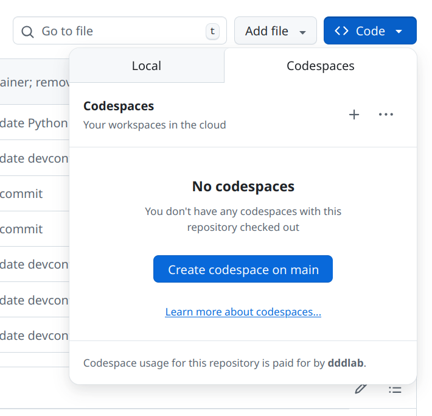
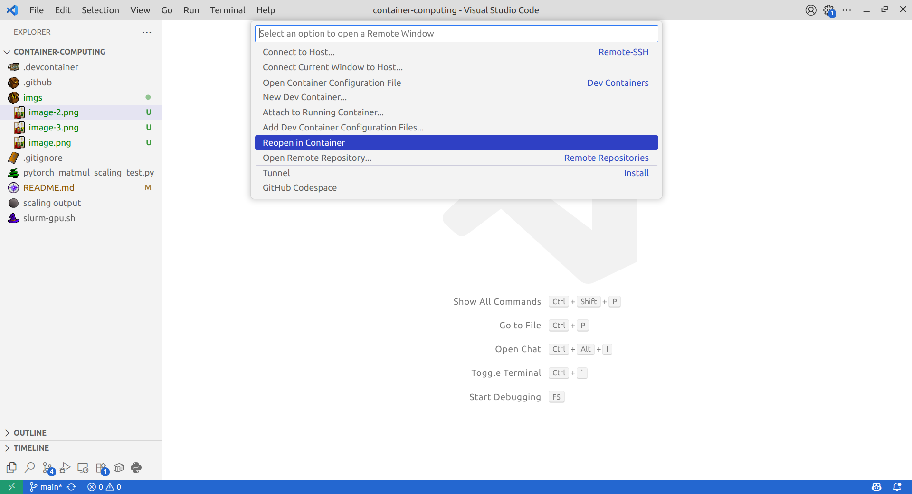
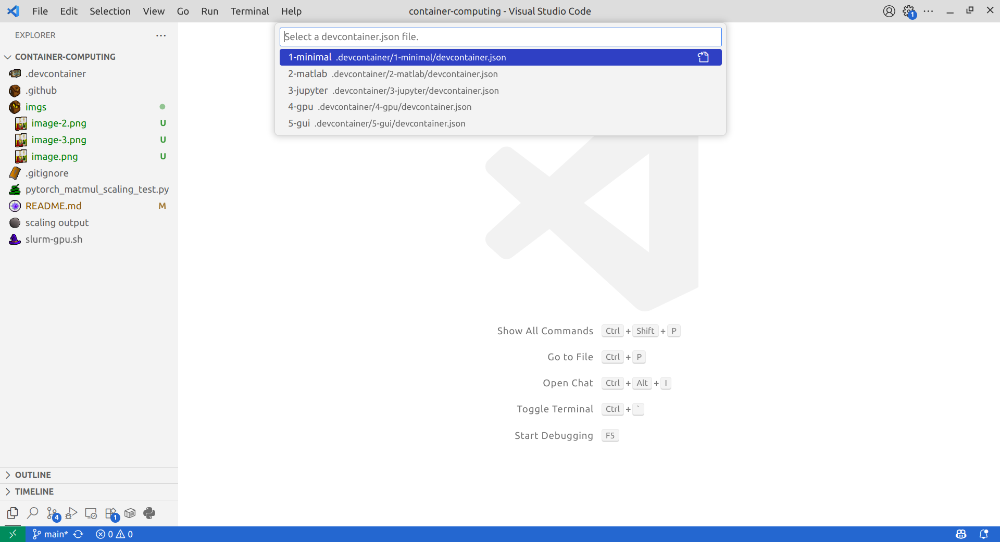

# Supplement for "Container-driven Reproducible Research with Development Containers"

<p align="center">
    <a href="https://github.com/dddlab/container-computing/actions/workflows/build-image.yml">
        
    </a>
</p>

The following repository contains a number of example Docker based [Development Containers](https://containers.dev/) from our paper. All containers are listed under the `.devcontainer` directory with an additional SLURM script each can be tested on the following systems:

- Devcontainers 1,2,3,5: Any system using Docker container engine
- Devcontainer 4: Any system with a CUDA 12 enabled Nvidia GPU
- `slurm-gpu.sh`: Texas A&M University's FASTER cluster

## Usage

Before using this, you must have [Visual Studio Code](https://code.visualstudio.com/) (VS Code) and the [Dev Container extension](https://marketplace.visualstudio.com/items?itemName=ms-vscode-remote.remote-containers) downloaded and installed. Additionally, the latest version of [Docker Desktop](https://docs.docker.com/get-started/get-docker/) or [Docker Engine](https://docs.docker.com/engine/install/) is required to run this on a local machine. GitHub Codespaces is an optional alternative and can be launched via the "Code" dropdown menu in this repository:

<p align="center">
    
</p>

**Note:** Multiple container profiles used in this repository are not supported by GitHub Codespaces and therefore are only compatible with VS Code. *There is a default container that follows `./.devcontainer/3-jupyter` schema that will launch if using Codespaces.*


1. Clone the repository on your desired system:

```sh
git clone git@github.com:dddlab/container-computing.git
```

2. Open the cloned folder using VS Code.

3. Using the "Remote Window" interface, select "Reopen in Container":

<p align="center">
    
</p>

<p align="center">
    
</p>

4. Select the desired container to build:

<p align="center">
    
</p>

5. If you wish to run the SLURM script, simply schedule it to be run by using `sbatch slurm-gpu.sh` on a compatible system. 
