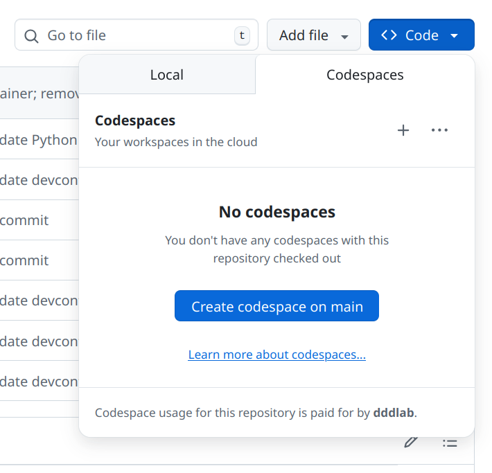
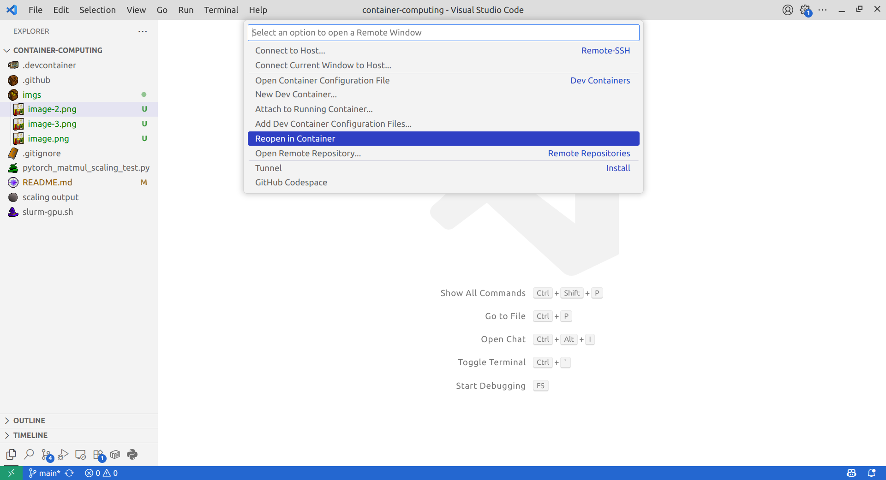
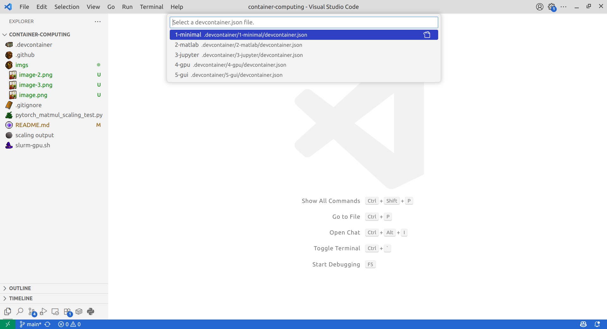

# Supplement for "Container-driven Reproducible Research with Development Containers"

<p align="center">
    <a href="https://github.com/dddlab/container-computing/actions/workflows/build-image.yml">
        
    </a>
</p>

The following repository contains a number of example Docker based [Development Containers](https://containers.dev/) from our paper. All containers are listed under the `.devcontainer` directory. Along with these containers is a SLURM script and an example GitHub Action discussed in the paper. Here is a summary of each example and the systems that they can be run on:

| Resource Name | Description | Compatible System |
| --- | --- | --- |
| [`1-minimal`](./.devcontainer/1-minimal/) | [`devcontainer.json`](./.devcontainer/1-minimal/devcontainer.json) for a minimal Ubuntu-based image. No Dockerfile is required since a pre-specified image is used. | Any system using Docker container engine |
| [`2-matlab`](./.devcontainer/2-matlab/) | [`Dockerfile`](./.devcontainer/2-matlab/Dockerfile) and [`devcontainer.json`](./.devcontainer/2-matlab/devcontainer.json) for a Matlab-based container image. | Any system using Docker container engine |
| [`3-jupyter`](./.devcontainer/3-jupyter/) | [`Dockerfile`](./.devcontainer/3-jupyter/Dockerfile) and [`devcontainer.json`](./.devcontainer/3-jupyter/devcontainer.json) for a Jupyter-based container image. | Any system using Docker container engine |
| [`4-gpu`](./.devcontainer/4-gpu/) | [`devcontainer.json`](./.devcontainer/4-gpu/devcontainer.json) for Jupyter-based GPU container image. No Dockerfile is required since a pre-specified image is used. Additional run arguments are passed to activate the NVIDIA runtime and select the desired GPUs. | Any system using Docker container engine with a CUDA 12 enabled NVIDIA GPU |
| [`5-gui`](./.devcontainer/5-gui/) | GUI in [`devcontainer.json`](./.devcontainer/5-gui/devcontainer.json) as described in Kraut (2024). No Dockerfile is required since a pre-specified image is used. Enables an interactive Ubuntu desktop for container interaction without a terminal. | Any system using Docker container engine |
| [`slurm-gpu.sh`](./slurm-gpu.sh) | Using a Docker image as an Apptainer-compatible container via a typical SLURM script. | [TACC Stampede3 cluster](https://tacc.utexas.edu/systems/stampede3/) |
| [`example.yml`](./.github/workflows/example.yml) | A GitHub action workflow that builds, runs a test command, and pushes the container to the GitHub Container Registry. | GitHub Actions |

## Usage

Before using this, you must have [Visual Studio Code](https://code.visualstudio.com/) (VS Code) and the [Dev Container extension](https://marketplace.visualstudio.com/items?itemName=ms-vscode-remote.remote-containers) downloaded and installed. Additionally, the latest version of [Docker Desktop](https://docs.docker.com/get-started/get-docker/) or [Docker Engine](https://docs.docker.com/engine/install/) is required to run this on a local machine. For more information on system requirements, [jump to the next section](https://github.com/dddlab/container-computing?tab=readme-ov-file#development-container-system-requirements). 

GitHub Codespaces is an alternative option for simpler testing and can be launched via the "Code" dropdown menu in this repository:

<p align="center">
    
</p>

> [!NOTE]
> Multiple container profiles used in this repository are not supported by GitHub Codespaces and therefore are only compatible with VS Code. *There is a default container that follows `./.devcontainer/3-jupyter` schema that will launch if using Codespaces.*


1. Clone the repository on your desired system:

```sh
git clone git@github.com:dddlab/container-computing.git
```

2. Open the cloned folder using VS Code.

3. Using the "Remote Window" interface, select "Reopen in Container":

<p align="center">
    
</p>

<p align="center">
    
</p>

4. Select the desired container to build:

<p align="center">
    
</p>

5. If you wish to run the SLURM script, simply schedule it to be run by using `sbatch slurm-gpu.sh` on a compatible system. 

## Development Container System Requirements

The development container documentation's [system requirements](https://code.visualstudio.com/docs/devcontainers/containers#_system-requirements) section is replicated here for convenience.

### Local / Remote Host

You can use Docker with the Dev Containers extension in a few ways, including:
- Docker installed locally.
- Docker installed on a remote environment.
- Other Docker-compliant CLIs, installed locally or remotely. (While other CLIs may work, they are not officially supported.)

Below are some specific ways you can configure Docker on a local or remote host:
- **Windows:** Docker Desktop 2.0+ on Windows 10 Pro/Enterprise. Windows 10 Home (2004+) requires Docker Desktop 2.3+ and the WSL 2 back-end. (Docker Toolbox is not supported. Windows container images are not supported.)
- **macOS:** Docker Desktop 2.0+.
- **Linux:** Docker CE/EE 18.06+ and Docker Compose 1.21+. (The Ubuntu snap package is not supported.)
- **Remote hosts:** 1 GB RAM is required, but at least 2 GB RAM and a 2-core CPU is recommended.

### Containers

- x86_64 / ARMv7l (AArch32) / ARMv8l (AArch64) Debian 9+, Ubuntu 16.04+, CentOS / RHEL 7+
- x86_64 Alpine Linux 3.9+

Other `glibc`-based Linux containers may work if they have the required Linux prerequisites.

### Installation

To get started, follow these steps:

1. Install and configure Docker for your operating system, using one of the paths below or an alternative Docker option, like Docker on a remote host or a Docker-compliant CLI.
   - **Windows / macOS:**
     1. Install Docker Desktop for Windows/Mac.
     2. If you are using WSL 2 on Windows, ensure the WSL 2 back-end is enabled: Right-click on the Docker taskbar item and select *Settings*. Check *Use the WSL 2 based engine* and verify your distribution is enabled under *Resources > WSL Integration*.
     3. When not using the WSL 2 back-end, right-click on the Docker taskbar item, select *Settings*, and update *Resources > File Sharing* with any locations your source code is kept.
   - **Linux:**
     1. Follow the official install instructions for Docker CE/EE for your distribution. If you are using Docker Compose, follow the Docker Compose directions as well.
     2. Add your user to the `docker` group by using a terminal to run: `sudo usermod -aG docker $USER`
     3. Sign out and back in again so your changes take effect.
2. Install Visual Studio Code or Visual Studio Code Insiders.
3. Install the Dev Containers extension. If you plan to work with other remote extensions in VS Code, you may choose to install the Remote Development extension pack.

---

## HPC Usage Results

The Docker image, `nvcr.io/nvidia/pytorch:25.08-py3`, was used to test the performance of two systems' scaling test code [`pytorch_matmul_scaling_test.py`](./pytorch_matmul_scaling_test.py) from [Texas Advanced Computing Center's (TACC) repository](https://github.com/TACC/containers_at_tacc). One is a virtual machine on Jetstream2 with NVIDIA A100X-20C and the other is NVIDIA H100 on Stampede3 at TACC. The following Linux commands are used to create an Apptainer image from a Docker image on TACC's Stampede3:

```sh
cd $SCRATCH
module load tacc-apptainer
apptainer pull pytorch.sif nvcr.io/nvidia/pytorch:25.08-py3
```

This Apptainer image is then used in combination with a [SLURM script](./slurm-gpu.sh) to execute the benchmark test. The PyTorch Matrix Multiplication Benchmark (v2.8.0a0+34c6371d24.nv25.08) results are as follows:

  System      | Device | Device Model          | Matrix Size   | Time (s) | Performance       |
 |-------------|--------|-----------------------|---------------|----------|--------------------|
 | Jetstream2  | CPU    | AMD Milan 7713        | 2048 × 2048   | 0.0286   | 601.72 GFLOPS      |
 |             |        |                       | 4096 × 4096   | 0.1330   | 1.03 TFLOPS        |
 |             |        |                       | 8192 × 8192   | 1.0658   | 1.03 TFLOPS        |
 | Stampede3   | CPU    | Intel Xeon Platinum 8468 | 2048 × 2048 | 0.1181   | 145.47 GFLOPS      |
 |             |        |                       | 4096 × 4096   | 0.9293   | 147.89 GFLOPS      |
 |             |        |                       | 8192 × 8192   | 7.5455   | 145.72 GFLOPS      |
 | Jetstream2  | GPU    | NVIDIA A100X-20C      | 2048 × 2048   | 0.0004   | 40.92 TFLOPS       |
 |             |        |                       | 4096 × 4096   | 0.0026   | 52.82 TFLOPS       |
 |             |        |                       | 8192 × 8192   | 0.0192   | 57.15 TFLOPS       |
 | Stampede3   | GPU    | NVIDIA H100           | 2048 × 2048   | 0.0002   | 101.49 TFLOPS      |
 |             |        |                       | 4096 × 4096   | 0.0007   | 204.20 TFLOPS      |
 |             |        |                       | 8192 × 8192   | 0.0050   | 220.89 TFLOPS      |
